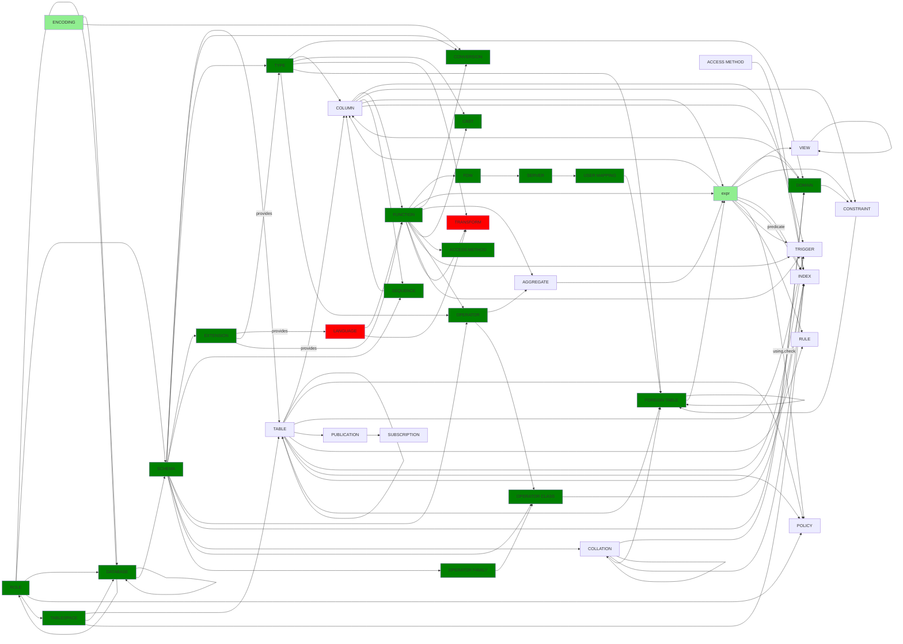

# Omnibus

Covering...

- [x] [ACCESS METHOD](./sql/omnibus/create_access_method.sql)
- [x] [AGGREGATE](./sql/omnibus/create_aggregate.sql)
- [x] [CAST](./sql/omnibus/create_cast.sql)
- [x] [COLLATION](./sql/omnibus/create_collation.sql)
- [x] [CONVERSION](./sql/omnibus/create_conversion.sql)
- [x] [DATABASE](./sql/omnibus/create_database.sql)
- [x] [DOMAIN](./sql/create_domain.sql)
- [x] [EVENT TRIGGER](./sql/omnibus/create_event_trigger.sql)
- [x] [EXTENSION](./sql/003_create_extension.sql)
- [x] [FOREIGN DATA WRAPPER](./sql/010_create_foreign.sql)
- [x] [FOREIGN TABLE](./sql/010_create_foreign.sql)
- [x] [FUNCTION](./sql/omnibus/create_function.sql)
- [x] [GROUP](./sql/000_create_users_roles.ddl.sql)
- [x] [INDEX](./sql/18_create_index.ddl.sql)
- [ ] LANGUAGE : requires dynamic linking
- [ ] MATERIALIZED VIEW
- [x] [OPERATOR](./sql/007_create_base_type.ddl.sql)
- [x] [OPERATOR CLASS](./sql/14_create_access_method.ddl.sql)
- [x] [OPERATOR FAMILY](./sql/14_create_access_method.ddl.sql)
- [x] [POLICY](./sql/19_create_policy.ddl.sql)
- [x] [PROCEDURE](./sql/010_create_function.sql)
- [ ] PUBLICATION
- [x] [ROLE](./sql/000_create_users_roles.ddl.sql)
- [ ] RULE
- [x] SCHEMA
- [x] [SEQUENCE](./sql/omnibus/create_seq.ddl.sql)
- [x] [SERVER](./sql/010_create_foreign.sql)
- [ ] STATISTICS
- [ ] SUBSCRIPTION
- [x] TABLE
  - [x] [ordinary](./sql/010_create_ordinary_table.ddl.sql)
  - [ ] partitioned
  - [ ] inherited
  - [ ] defined by query
- [x] [`TABLESPACE`](./sql/001_create_tablespace.ddl.sql)
- [ ] TEXT SEARCH CONFIGURATION
- [ ] TEXT SEARCH DICTIONARY
- [ ] TEXT SEARCH PARSER
- [ ] TEXT SEARCH TEMPLATE
- [ ] TRANSFORM : requires dynamic linking
- [x] [TRIGGER](./sql/17_create_trigger.ddl.sql)
- [x] TYPE
  - [x] [composite](./sql/004_create_composite_type.ddl.sql)
  - [x] [enum](./sql/005_create_enum_type.ddl.sql)
  - [x] [range](./sql/006_create_range_type.sql)
  - [x] [base](./sql/007_create_base_type.ddl.sql)
  - [x] [shell](./sql/007_create_base_type.ddl.sql)
- [x] [USER](./sql/000_create_users_roles.ddl.sql)
- [x] [USER MAPPING](./sql/010_create_foreign.sql)
- [x] VIEW

- [Built-in types](./sql/01_create_ordinary_table.ddl.sql)

  - [x] [Numeric Types](https://www.postgresql.org/docs/current/datatype-numeric.html)
    - [x] `BIGINT`
    - [x] `BIGSERIAL`
    - [x] `DECIMAL`
    - [x] `DOUBLE PRECISION`
    - [x] `INT4`
    - [x] `INT8`
    - [x] `INTEGER`
    - [x] `NUMERIC(precision, scale)`
    - [x] `NUMERIC(precision)`
    - [x] `NUMERIC`
    - [x] `SERIAL`
    - [x] `SMALLINT`
    - [x] `SMALLSERIAL`
  - [x] [Monetary Types](https://www.postgresql.org/docs/current/datatype-money.html)
    - [x] `money`
  - [x] [Character Types](https://www.postgresql.org/docs/current/datatype-character.html)

    - [x] `character varying(n), varchar(n)`
    - [x] `character(n), char(n)`
    - [x] `text`

  - [x] [Binary Data Types](https://www.postgresql.org/docs/current/datatype-binary.html)
    - [x] `BYTEA`
  - [x] [Date/Time Types](https://www.postgresql.org/docs/current/datatype-datetime.html)
    - [x] `timestamp [ (p) ] [ without time zone ]`
    - [x] `timestamp [ (p) ] with time zone`
    - [x] `date`
    - [x] `time [ (p) ] [ without time zone ]`
    - [x] `time [ (p) ] with time zone`
    - [x] `interval [ fields ] [ (p) ]`
  - [x] [Boolean Type](https://www.postgresql.org/docs/current/datatype-boolean.html)
  - [x] [Geometric Types](https://www.postgresql.org/docs/current/datatype-geometric.html)
    - [x] `point`
    - [x] `line`
    - [x] `lseg`
    - [x] `box`
    - [x] `path`
    - [x] `path`
    - [x] `polygon`
    - [x] `circle`
  - [x] [Network Address Types](https://www.postgresql.org/docs/current/datatype-net-types.html)
    - [x] `cidr`
    - [x] `inet`
    - [x] `macaddr`
    - [x] `macaddr8`
  - [x] [Bit String Types](https://www.postgresql.org/docs/current/datatype-bit.html)

    - [x] `BIT(n)`
    - [x] `BIT VARYING(n)`

  - [ ] [Text Search Types](https://www.postgresql.org/docs/current/datatype-textsearch.html)
  - [ ] [UUID Type](https://www.postgresql.org/docs/current/datatype-uuid.html)
  - [ ] [XML Type](https://www.postgresql.org/docs/current/datatype-xml.html)
  - [ ] [JSON Type](https://www.postgresql.org/docs/current/datatype-json.html)
  - [ ] [Arrays](https://www.postgresql.org/docs/current/arrays.html)
  - [ ] [Range and Multirange Types](https://www.postgresql.org/docs/current/rangetypes.html#RANGETYPES-BUILTIN)
  - [ ] [Pseudo-Types](https://www.postgresql.org/docs/current/datatype-pseudo.html)

Dependencies:

